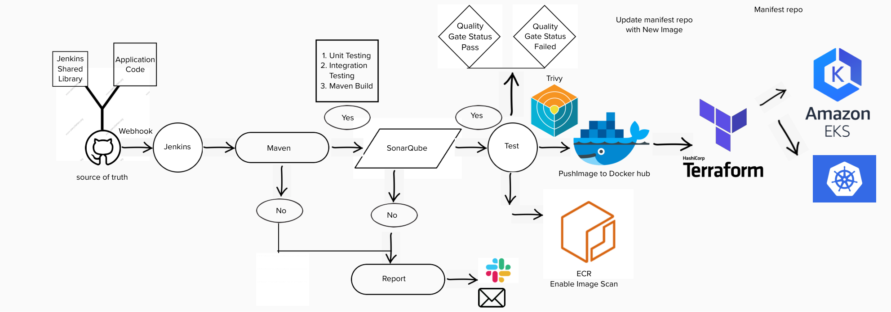

# Jenkins Pipeline for Java based application using Maven, SonarQube, Argo CD, Helm and Kubernetes


## JAVA CI-CD pipeline
Jenkins


Install Jenkins, configure Docker as agent, set up cicd, deploy applications to k8s and much more.

## AWS EC2 Instance

- Go to AWS Console
- Instances(running)
- Launch instances


### Install Jenkins.
In the EC2 userdata add scripts
1. [Install Jenkins](/home/the-rexy/OneDrive/Desktop/dev-projects/interview projects/installation_scripts.git/jenkins.sh)
2. [Install Docker](/home/the-rexy/OneDrive/Desktop/dev-projects/interview projects/installation_scripts.git/docker.sh)
3. [Install SonarQube](/home/the-rexy/OneDrive/Desktop/dev-projects/interview projects/installation_scripts.git/sonarqube.sh) as Docker container 
4. Then Launch Jenkins

### Login to Jenkins using the below URL:

http://<ec2-instance-public-ip-address>:8080    [You can get the ec2-instance-public-ip-address from your AWS EC2 console page]

Note: If you are not interested in allowing `All Traffic` to your EC2 instance
1. Delete the inbound traffic rule for your instance
2. Edit the inbound traffic rule to only allow custom TCP port `8080`

After you login to Jenkins,
- Run the command to copy the Jenkins Admin Password - `sudo cat /var/lib/jenkins/secrets/initialAdminPassword`
- Enter the Administrator password


- cat address location to get password

### Click on Install suggested plugins


Wait for the Jenkins to Install suggested plugins


Create First Admin User or Skip the step [If you want to use this Jenkins instance for future use-cases as well, better to create admin user]


Jenkins Installation is Successful. You can now starting using the Jenkins


a. Troubleshoot, make sure Docker is running
i. It has 2 Jenkins files for pipeline that uses build with parameter using CHOICE(uses a dropbdown: when { expression {  params.action == 'create' } } and STRING(uses textboxt)
ii. pipeline for local/dockerhub repository and when run use build with parameter
```groovy
parameters{
choice(name: 'action', choices: 'create\ndelete', description: 'Choose create/Destroy')
string(name: 'ImageName', description: "name of the docker build", defaultValue: 'javapp')
string(name: 'ImageTag', description: "tag of the docker build", defaultValue: 'v1')
string(name: 'DockerHubUser', description: "name of the Application", defaultValue: 'trex1987')
}
```

iii. pipeline for AWS ECR
```groovy
parameters{

    choice(name: 'action', choices: 'create\ndelete', description: 'Choose create/Destroy')
    string(name: 'aws_account_id', description: " AWS Account ID", defaultValue: '690274493847')
    string(name: 'Region', description: "Region of ECR", defaultValue: 'us-east-2')
    string(name: 'ECR_REPO_NAME', description: "name of the ECR", defaultValue: 'the-rexy-java')
    string(name: 'cluster', description: "name of the EKS Cluster", defaultValue: 'demo-cluster1')
}
```
iv. CD part
We use: ```dir('eks_module') {…}```, to get access to terraform file
i. I want the terraform aws access keys to be called from Jenkins and not hard coded into terraform using, we makes sure we have terraform installed and configured on local system:
later add sh script dev, stage, QA, Production
```shell
environment{
ACCESS_KEY = credentials('AWS_ACCESS_KEY_ID')
SECRET_KEY = credentials('AWS_SECRET_KEY_ID')
}
```
Then call it in Jenkins Eks part as and run im multiline the terraform scripts:
```shell
dir('eks_module') {
sh """
terraform init
terraform plan -var 'access_key=$ACCESS_KEY' -var 'secret_key=$SECRET_KEY' -var 'region=${params.Region}' --var-file=./config/terraform.tfvars
terraform apply -var 'access_key=$ACCESS_KEY' -var 'secret_key=$SECRET_KEY' -var 'region=${params.Region}' --var-file=./config/terraform.tfvars --auto-approve
"""
}
```
ii. Next we make sure we install and configure aws-cli on server, 	set the Access & secret key  and connect to EKS using:
```shell
script{
sh """
aws configure set aws_access_key_id "$ACCESS_KEY"
aws configure set aws_secret_access_key "$SECRET_KEY"
aws configure set region "${params.Region}"
aws eks --region ${params.Region} update-kubeconfig --name ${params.cluster}
"""
}
```
iii. Next we deploy k8s manifest to EKS in Jenkins:
Using choice to get it started, then use “input message: “ to get true or false, it shows inline in pipeline or console view, if false don’t fail show red sight, just exit as unstable)
script{
```groovy
def apply = false

  try{
    input message: 'please confirm to deploy on eks', ok: 'Ready to apply the config ?'
    apply = true
  }catch(err){
    apply= false
    currentBuild.result  = 'UNSTABLE' //dont make the current build FAIL if user has deniewd
  }
  if(apply){
    sh """
      kubectl apply -f .
    """
  }
```

